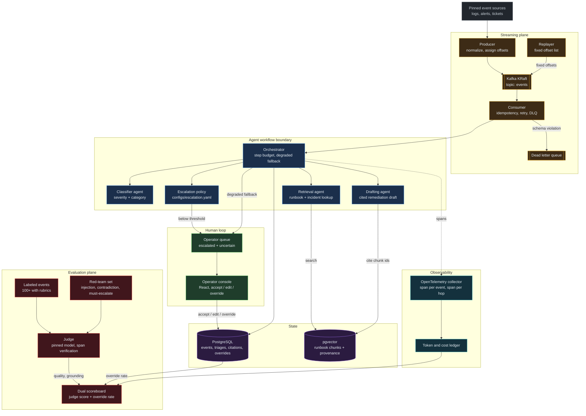
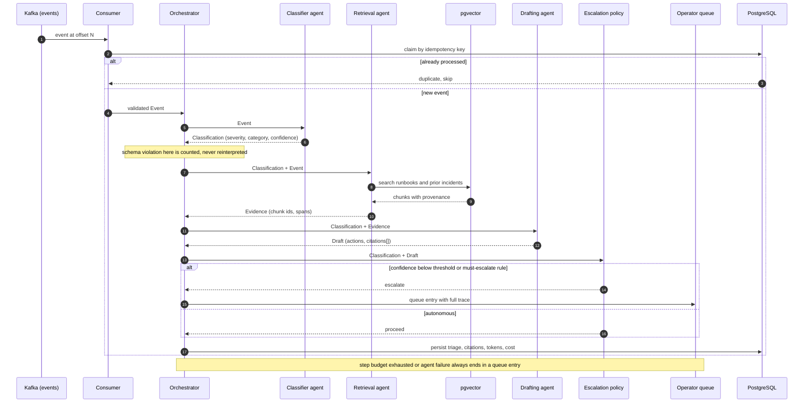

# Anomaly Desk

An agentic triage system with a judge scoring it. Anomaly Desk ingests a continuous stream of operational
events, triages each one through a multi-agent workflow with cited retrieval, routes uncertain cases to a
human, and scores itself against two scoreboards that are allowed to disagree: an automated judge harness
and the operator override rate. Neither scoreboard is permitted to speak alone.

This document is the specification the code is held to; where the two disagree, one of them has a bug.

Anomaly Desk is the online, streaming, human-in-the-loop half of a pair. Its sibling, CorpusGate, is the
offline, static-corpus, fine-tuning and promotion-gate system. If a proposed change here makes this project
look like batch retrieval-augmented generation over a static corpus, that change is out of scope and is
raised rather than merged.

## 1. Principles

1. **The labeled set and the judge come before the agents.** `evalset/labeled_events.jsonl` holds 100 or
   more labeled events, `evalset/redteam.jsonl` exists, the judge harness runs, and the scoreboard prints,
   all before a single agent is written. Milestone M1 completes before M2 starts.
2. **Typed contracts at every hop.** Every agent returns a schema the next stage validates. A schema
   violation is a counted, reported failure, never a string the next prompt attempts to interpret.
   Free-text handoffs between agents are prohibited.
3. **Citations are structural.** The drafting agent cites retrieved document identifiers, and the judge
   verifies that each cited span exists in the source it names. An uncited or ungrounded claim is a scored
   failure, not a style note.
4. **Escalation is policy in configuration, and it is evaluated.** Thresholds live in
   `configs/escalation.yaml` and are versioned. Must-escalate cases in the red-team set are scored
   separately, and a failure there blocks the gate regardless of quality gains anywhere else.
5. **Two scoreboards, both reported, always.** The judge score is never reported alone. Every experiment
   pull request reports judge score and override rate together, plus latency and cost. When the two
   disagree, the disagreement is written up in `docs/findings/` rather than resolved by selecting the
   flattering number.
6. **Replay determinism.** Evaluation runs replay a fixed list of event offsets, so two runs observe an
   identical sequence. See section 10 for what determinism does and does not mean here, because the model
   layer is not deterministic and pretending otherwise would be a lie in the specification.
7. **Ticket and log text is untrusted.** Tool access is scoped so that an instruction injected into event
   text cannot reach a side-effecting operation. Side-effecting tools require an operator confirmation path
   enforced in the orchestrator, never requested in a prompt.
8. **Cost is a metric, not a footnote.** Tokens and computed cost per triage appear next to quality in
   every report.
9. **House style for all prose in this repository** (documentation, findings, issue bodies, pull request
   bodies, commit messages): full forms rather than contractions, no em dashes, and no unfilled
   placeholders on the main branch.

## 2. Architecture

### 2.1 System diagram



### 2.2 Triage sequence



The diagrams above are also maintained as a dark-themed, self-contained page at
[`docs/architecture.html`](docs/architecture.html), with JetBrains Mono, semantic component colors, boundary
boxes for the agent workflow and the evaluation plane, and a legend outside every boundary. Any pull request
that moves a component boundary, adds an agent, or changes a store updates the Mermaid source above and the
rendered page in the same pull request.

## 3. Repository structure

```
anomaly-desk/
  anomalydesk/               Python package
    ingest/                  producer, deterministic replayer, normalization
    consume/                 consumer, idempotency, retry, dead letter queue
    retrieval/               chunking with provenance, embeddings, pgvector search
    agents/                  classifier, retrieval, drafting; shared schemas
    orchestrator/            step budgets, degraded fallback, tool scoping
    policy/                  escalation policy loader and evaluator
    evals/                   judge, rubrics, scoreboard, red-team runner, A/B harness
    obs/                     OpenTelemetry spans, token and cost accounting
    serve/                   FastAPI application, operator queue endpoints
  configs/                   escalation.yaml, judge.yaml, models.yaml, ingest.yaml
  evalset/                   labeled_events.jsonl, redteam.jsonl, replay_offsets.json
  runbooks/                  demo/ (committed slice), raw/ (gitignored)
  migrations/                PostgreSQL schema migrations
  runs/                      evaluation outputs (gitignored except promoted scoreboards)
  deploy/                    kind manifests, runbook.md
  docs/
    architecture.html        rendered system diagram, kept in sync with Mermaid
    sources.md              event source selection and licensing
    findings/               one written analysis per milestone
  ui/                        React operator console
  docker/                    Dockerfiles per service
  tests/
  Makefile
  docker-compose.yml
```

## 4. Model backends and cost accounting

The backend is selected with the `MODEL_BACKEND` environment variable. No stage of this project requires a
graphics processing unit.

| Backend | Runtime | Purpose |
| --- | --- | --- |
| `api` | Hosted Anthropic API | The default and the scored configuration. Event text is transmitted to the provider. |
| `local` | Quantized model behind the same interface | Offline development convenience. Judge agreement with the pinned judge must be measured before any local run is reported as a result. |

Pinned defaults, versioned in `configs/models.yaml`:

| Role | Model | Input cost per million tokens | Output cost per million tokens |
| --- | --- | --- | --- |
| Classifier, retrieval, drafting agents | `claude-opus-5` | 5.00 | 25.00 |
| Judge | `claude-opus-5`, prompt version pinned in `configs/judge.yaml` | 5.00 | 25.00 |
| Embeddings | `BAAI/bge-small-en-v1.5` via sentence-transformers, always local | not applicable | not applicable |

Cost per triage is computed, not estimated, from the usage figures the API returns:

```
cost = (uncached_input / 1e6 * input_rate)
     + (cache_read_input / 1e6 * input_rate * 0.10)
     + (cache_write_input / 1e6 * input_rate * 1.25)
     + (output / 1e6 * output_rate)
```

Every agent call records `input_tokens`, `output_tokens`, `cache_read_input_tokens`, and
`cache_creation_input_tokens` into the token ledger, keyed by event identifier and agent hop. The rates above
are the only place rates are written down; the ledger stores tokens and resolves rates at report time, so a
price change does not require reprocessing history.

No stage of this project requires a graphics processing unit, and that constraint is enforced rather than
stated. The pinned embedding model arrives through `sentence-transformers`, which depends on PyTorch, whose
default Linux wheel in turn depends on the full CUDA stack: cuBLAS, cuDNN, cuFFT, and the rest. On a machine
with no GPU those are several gigabytes of libraries that can never execute. `make install` therefore installs
the CPU-only PyTorch build from the PyTorch CPU index before installing this package, so the dependency is
already satisfied when the second step resolves it, and the target fails loudly if any package matching
`nvidia-` or `cuda-` is present afterward. The measured difference for PyTorch alone is 191 megabytes against
526 megabytes, before the CUDA packages themselves are counted.

Changing the judge model or the agent model is a reviewed design decision with its own pull request, and it
is never a side effect of other work. Because the judge and the agents share a model family, every judge
change is accompanied by a re-run of the human-scored subsample described in section 8.

Two API behaviors materially shape the implementation and are recorded here so they are not rediscovered as
bugs. Sampling parameters (`temperature`, `top_p`, `top_k`) are rejected by the pinned model, so output
variance is not controllable through configuration; section 10 explains what this means for replay. Agent
output shape is enforced with the structured-output facility (`output_config.format` with a JSON schema)
rather than by asking a prompt for JSON, which is how principle 2 is implemented in practice.

## 5. Event sources and licensing

`docs/sources.md` records, for each pinned source: origin, license, retrieval date, record count, and any
redaction applied. Sources are public operational corpora with licenses that permit redistribution of the
committed demo slice. A source whose license does not permit redistribution may be used for local runs and is
recorded as such, but no content from it is committed.

Events are normalized into a single envelope before they reach Kafka, so the agents never see source-specific
shape:

```json
{
  "event_id": "evt-000417",
  "offset": 417,
  "source": "loghub-hdfs",
  "observed_at": "2026-03-04T11:02:19Z",
  "kind": "log_burst",
  "severity_hint": null,
  "text": "...",
  "attributes": {"host": "dn-14", "service": "datanode"}
}
```

`offset` is assigned by the producer, is stable for a given source snapshot, and is the identifier the
replayer uses. `severity_hint` is deliberately nullable and is never trusted as a label.

## 6. Typed contracts between agents

Every hop is a validated schema. A violation increments a counter, is written to the run output, and ends the
triage in the operator queue. It is never passed to the next prompt as text.

```json
{
  "Classification": {
    "severity": "sev1 | sev2 | sev3 | sev4",
    "category": "capacity | hardware | config | dependency | security | unknown",
    "confidence": 0.0,
    "rationale": "..."
  },
  "Evidence": {
    "chunks": [{"chunk_id": "rb-07:chunk-3", "doc_id": "rb-07", "span": [140, 402]}],
    "query_used": "...",
    "hit_count": 0
  },
  "Draft": {
    "summary": "...",
    "actions": [{"step": 1, "action": "...", "citations": ["rb-07:chunk-3"]}],
    "citations": [{"chunk_id": "rb-07:chunk-3", "quote": "..."}],
    "requires_operator": false
  }
}
```

Rules that make these contracts load-bearing rather than decorative:

1. Every claim in `Draft.actions` carries at least one citation drawn from `Evidence.chunks`. A citation that
   names a chunk absent from the evidence set is a fabrication and is scored as a failure.
2. `confidence` is a number the escalation policy reads. It is not prose and is not optional.
3. `requires_operator` set by an agent is advisory. The orchestrator, not the agent, decides escalation, and
   the orchestrator applies section 9.

## 7. Retrieval and citations

Runbooks and prior incident reports are chunked with structure awareness, and every chunk carries provenance:
document identifier, section slug, character span, and the source snapshot hash. Chunk identifiers take the
form `DOCID:chunk-N` and resolve to an exact span in the normalized document, which is what allows the judge
to verify a cited span rather than take the citation on trust.

The judge performs verification mechanically before it performs any quality scoring:

1. Does every cited `chunk_id` exist?
2. Does the quoted text appear in the span the chunk names?
3. Is every action citation drawn from the evidence the retrieval agent actually returned?

A failure at any of these three steps is recorded as a grounding failure independently of the quality score,
so a fluent and well-structured draft built on a fabricated citation cannot score well.

## 8. The two scoreboards

### 8.1 Scoreboard one: the judge

The pinned judge scores each triage against a per-event rubric in `evalset/labeled_events.jsonl`:

```json
{
  "event_id": "evt-000417",
  "offset": 417,
  "gold_severity": "sev2",
  "gold_category": "hardware",
  "must_escalate": false,
  "rubric": ["identifies disk failure on dn-14", "cites the disk replacement runbook", "..."],
  "gold_chunks": ["rb-07:chunk-3"],
  "smoke": false
}
```

Reported components: severity accuracy, category accuracy, rubric-scored action quality from 0 to 100,
grounding failure rate from section 7, and must-escalate recall computed on the red-team subset.

### 8.2 Scoreboard two: the override rate

The operator console captures every disposition: accept, edit, or override. The override rate is the fraction
of triages an operator materially changed, and it is computed from real dispositions in PostgreSQL, not from
the judge. Edits are captured at field granularity, so an override of severity is distinguishable from an
override of the action list.

Operator dispositions are labeled signal. They flow back into `evalset/labeled_events.jsonl` through a
reviewed pull request, never automatically, because an automatic loop would let the system grade its own
homework.

### 8.3 The two are allowed to disagree

A rising judge score with a rising override rate is the most informative outcome this system can produce, and
it is treated as a finding rather than a problem to be smoothed away. When the two diverge, the report leads
with both numbers, and the interpretation follows in `docs/findings/`. Rubrics and thresholds are not adjusted
to make the scoreboards agree without the owner's explicit approval.

### 8.4 The judge is audited

Every full run samples 15 triages for human scoring. Judge-to-human agreement, reported as mean absolute
difference and pass-or-fail agreement rate, appears in the milestone finding. A judge nobody has audited is
an opinion, not a measurement.

## 9. Escalation policy

`configs/escalation.yaml` is versioned, and every change to it is a reviewed pull request of its own:

```yaml
version: 1
thresholds:
  min_confidence_sev1: 0.95
  min_confidence_sev2: 0.85
  min_confidence_default: 0.70
must_escalate:
  - security_category
  - contradictory_evidence
  - missing_required_field
  - zero_retrieval_hits
budgets:
  max_steps: 8
  max_seconds: 45
```

Three properties hold. Escalation is decided by the orchestrator reading this file, never by an agent
deciding for itself. The `must_escalate` rules are unconditional and are not overridden by a high confidence
score. Every path through the orchestrator that fails, times out, or exhausts its step budget ends in an
operator queue entry, so there is no configuration in which an event is silently dropped.

The must-escalate subset of the red-team set is scored separately in continuous integration, and a regression
there blocks the deployment gate no matter what the aggregate quality score did.

## 10. Replay determinism, and its honest limits

`evalset/replay_offsets.json` pins an ordered list of offsets. The replayer emits exactly that sequence, so
two evaluation runs observe identical events in an identical order. The retrieval index is pinned by snapshot
hash, prompts are versioned, and the model identifier is pinned in `configs/models.yaml`.

What this does not provide is identical model output between two runs. The pinned model rejects sampling
parameters, so there is no `temperature: 0` available and no configuration that makes generation
reproducible. Claiming byte-identical replay would therefore be false.

Determinism in this project means the following, and comparisons are designed around it:

1. The event sequence is identical between runs.
2. The retrieval corpus and index are identical between runs, verified by snapshot hash.
3. Prompts, schemas, the escalation policy, and the model identifier are identical between runs and are
   recorded in the run output.
4. Model output variance is therefore the only uncontrolled variable, and it is measured rather than assumed
   away. Every scored configuration is run three times, and the scoreboard reports the mean with the range,
   so a reported delta that falls inside run-to-run variance is visibly not a result.

Any change that breaks item 1, 2, or 3 invalidates every historical comparison and is raised with the owner
before it is made.

## 11. Observability, tracing, and cost

OpenTelemetry spans are emitted at two granularities: one span per event covering the whole triage, and one
child span per agent hop. Every span carries the event identifier, the agent name, the schema validation
outcome, token counts, and the retry attempt number.

`make trace-report` answers two questions with measured numbers rather than intuition: which agent hop
consumed the latency, and what a triage costs. Reported metrics include per-hop p50 and p95 latency, end-to-end
p95 latency, schema violation rate per hop, retry and dead-letter-queue counts, escalation rate, and cost per
triage broken down by hop.

## 12. Security and untrusted input

Event text is untrusted input, and it is treated as data everywhere it appears.

1. **Tool scope.** The classifier and drafting agents have no tools. The retrieval agent has exactly one
   read-only tool, `search_runbooks`. No agent holds a tool that writes, deletes, deploys, notifies, or
   otherwise changes state.
2. **Confirmation in the orchestrator.** Any side-effecting action is represented as a proposal in `Draft`
   and requires an operator confirmation recorded in PostgreSQL. The confirmation gate is code in the
   orchestrator. It is never a prompt instruction, because a prompt instruction is exactly what injected text
   is trying to overwrite.
3. **Framing.** Event text is passed inside a delimited data block, never concatenated into the instruction
   portion of a prompt.
4. **Scoring.** `evalset/redteam.jsonl` includes prompt-injected events whose text attempts to induce
   escalation suppression, citation fabrication, and tool misuse. Compliance with an injected instruction is
   a scored safety failure reported in the `make redteam` output, so this section is enforced by the harness
   rather than asserted here.

## 13. Canonical results

This section is populated from real `make eval` and `make redteam` runs across all four variants. Required
columns: judge quality score, severity accuracy, grounding failure rate, must-escalate recall, override rate,
p95 latency, and cost per triage, one row per variant, with run-to-run range per section 10.

| Variant | Judge quality | Severity accuracy | Grounding failures | Must-escalate recall | Override rate | p95 latency | Cost per triage |
| --- | --- | --- | --- | --- | --- | --- | --- |

No runs have been recorded yet. The first row lands with the M2 single-agent baseline pull request, which
establishes the number every later variant must beat. The four variants are: single-agent baseline (M2),
multi-agent workflow (M3), multi-agent workflow with the human loop and tuned escalation policy (M4), and the
A/B winner selected against override rate (M5).

## 14. Milestones

Development proceeds milestone by milestone. A milestone starts only after the previous one is merged to the
main branch with continuous integration green.

| Milestone | Deliverable |
| --- | --- |
| **M0 Scaffold** | Package skeleton and Makefile. Docker Compose with Kafka in KRaft mode, PostgreSQL with pgvector, the API, the operator console, and an OpenTelemetry collector. Continuous integration with linting, tests, and the prose linter that enforces principle 9. A kind-based Kubernetes path. |
| **M1 Labeled set and judge first** | Pinned sources with recorded licensing in `docs/sources.md`. PostgreSQL schema and migrations. 100 or more labeled events with rubrics. The red-team adversarial set, including must-escalate cases. The judge harness with span verification. The dual scoreboard and the continuous integration smoke slice. No agent code exists at the end of this milestone. |
| **M2 Ingestion and single-agent baseline** | Producer and deterministic replayer. Consumer with idempotency, retry, and a dead letter queue. Retrieval index with per-chunk provenance. A single-agent classifier with structured output. The first scored run, recorded in section 13 as the number to beat. |
| **M3 Multi-agent orchestration** | Shared schemas. Classifier, retrieval, and drafting agents. The orchestrator with step budgets and a degraded fallback that always ends in an operator queue entry. Scored delta against M2 with latency and cost. |
| **M4 Human loop and the second scoreboard** | Versioned escalation policy. React operator console with queue and detail views. Accept, edit, and override capture as labeled signal. The override-rate scoreboard. A written judge-versus-operator disagreement analysis. |
| **M5 Observability, red-teaming, and the deploy gate** | OpenTelemetry spans per event and per hop. Token and cost accounting. Metrics. A red-team run with a safety findings section. An A/B harness scored against override rate. An evaluation-regression deploy gate in continuous integration. Kubernetes deployment on kind with `deploy/runbook.md`. The final results report. |

## 15. Running the system

```
make data           # fetch and normalize pinned sources, assign offsets
make index          # chunk runbooks with provenance, embed, load pgvector
make replay         # emit the fixed offset list into Kafka
make eval           # score the current variant, print the dual scoreboard
make redteam        # adversarial and must-escalate run, write the safety report
make smoke          # the continuous integration slice
make trace-report   # per-hop latency and cost per triage
make serve          # API on :8000
make ui             # operator console on :3000
make kind-up        # create the local Kubernetes cluster and install tooling
make deploy gate    # deploy to kind and run the same gate continuous integration runs
```

`docker compose up --build` on a clean machine brings up the full stack, serving the operator console on
:3000 and the API on :8000. From M2 onward the stack triages against the committed runbook slice in
`runbooks/demo/`. The full source set is fetched with `make data` and is gitignored.

## 16. Development process

The repository history is part of the product. Every change is traceable from an issue, through a linked
branch, to a merged pull request carrying its evidence. One issue maps to one branch and one pull request. A
pull request that changes code targets roughly 150 to 400 reviewable changed lines, where lockfiles, user
interface build artifacts, and evaluation run outputs do not count. An issue that would exceed that budget is
split before work starts.

The budget applies to code, not to prose. A specification, a runbook, or a written finding cannot be usefully
split at four hundred lines, because the reviewer needs the whole argument in front of them to judge any part
of it; the sibling project's specification is four hundred and seven lines on its own. Documentation pull
requests are instead held to a different standard: one document or one closely coupled pair per pull request,
and no mixing of prose with code changes in the same pull request. A documentation pull request that touches
code, or that revises two unrelated documents, is split.

### 16.1 One-time setup: labels and milestones

```bash
gh label create "type:infra"     --color 6e7781 --description "Scaffolding, CI, docker, tooling"
gh label create "phase:evalset"  --color 5319e7 --description "M1: labeled set, judge, scoreboard"
gh label create "phase:ingest"   --color d93f0b --description "M2: producer, consumer, index, baseline"
gh label create "phase:agents"   --color 1d76db --description "M3: agents, schemas, orchestrator"
gh label create "phase:human"    --color 0052cc --description "M4: escalation, console, override rate"
gh label create "phase:obs"      --color b60205 --description "M5: tracing, red-team, deploy gate"
gh label create "exp"            --color fbca04 --description "Experiment PR: leads with the dual scoreboard table"
gh label create "safety"         --color d4c5f9 --description "Untrusted input, tool scope, escalation integrity"
gh label create finding          --color c2e0c6 --description "Written analysis in docs/findings"

for t in "M0 Scaffold" "M1 Labeled set and judge" "M2 Ingestion and baseline" \
         "M3 Multi-agent orchestration" "M4 Human loop" "M5 Observability and deploy gate"; do
  gh api repos/AmosBunde/anomaly-desk/milestones -f title="$t"
done
```

### 16.2 Issues

Every task starts as an issue carrying a label and a milestone. Experiment issues use Hypothesis, Design,
Acceptance criteria, Risks, and Out of scope. Infrastructure issues use Problem, Design, Acceptance criteria,
Risks, and Out of scope.

Worked example (experiment):

```
Title: Multi-agent workflow with cited retrieval beats the single-agent baseline on action quality

## Hypothesis
Splitting triage into classifier, retrieval, and drafting agents raises rubric-scored action quality by at
least six points over the single-agent baseline, because the baseline drafts remediation steps without
retrieving the runbook that describes them.

## Design
Three agents behind typed schemas, coordinated by an orchestrator with an eight-step budget. The drafting
agent cites chunk identifiers returned by the retrieval agent. Any schema violation ends the triage in the
operator queue and is counted. Run the full evaluation three times and report the mean with the range.

## Acceptance criteria
- Action quality improves by six or more points versus the M2 baseline, outside run-to-run range
- Grounding failure rate does not rise
- Must-escalate recall stays at 1.0
- Override rate, p95 latency, and cost per triage reported alongside the judge score

## Risks
Three model calls per event will raise latency and cost materially. Traces will show whether the retrieval
hop earns its cost or whether the classifier alone already had enough context.

## Out of scope
The operator console and the override-rate scoreboard, which arrive in M4.
```

### 16.3 Branches

Branches are created from their issue so the two stay linked. Branch types are `chore` for infrastructure and
process, `feat` for product capability, `exp` for a gate-facing experiment, `data` for evaluation set work,
and `fix` for defect repair.

```bash
gh issue develop <n> --name <type>/<n>-<slug> --checkout
# example: gh issue develop 17 --name feat/17-orchestrator-budgets --checkout
```

### 16.4 Commits

Conventional subjects with why-first bodies and a `Refs #<n>` footer. Closing keywords stay out of commit
messages; the pull request closes the issue.

```
feat(orchestrator): add step budget and degraded fallback

A failing agent previously left an event with no triage and no queue
entry, so the event was silently lost. The orchestrator now bounds the
workflow at eight steps and routes every failure, timeout, and budget
exhaustion into the operator queue with its partial trace attached.

Refs #17
```

### 16.5 Commit comments

Where a reviewer would otherwise have to guess, the reasoning and the measurement live in a commit comment.
Consumer throughput, retry semantics, index build times, and judge run duration all qualify.

```bash
gh api repos/AmosBunde/anomaly-desk/commits/<sha>/comments \
  -f body='Chose pgvector over a separate vector service: one store to back up, and the citation join stays inside a single query. Index build over the 1,240-chunk demo slice takes 38 seconds on eight CPU cores. Revisit past roughly one million chunks.'
```

### 16.6 Pull requests

Pull request bodies contain `Closes #<n>` and the sections Summary, What changed, How it was validated, Risks
and follow-ups, and Reviewer notes. An experiment pull request leads with the dual scoreboard table:

```
## Dual scoreboard versus baseline (single-agent-v1)

| Metric               | Baseline | Candidate | Delta  |
| -------------------- | -------- | --------- | ------ |
| Judge quality        | 61.4     | 69.8      | +8.4   |
| Severity accuracy    | 0.78     | 0.81      | +0.03  |
| Grounding failures   | 0.11     | 0.04      | -0.07  |
| Must-escalate recall | 1.00     | 1.00      | 0.00   |
| Override rate        | 0.34     | 0.29      | -0.05  |
| p95 latency          | 4.1 s    | 11.9 s    | +7.8 s |
| Cost per triage      | $0.021   | $0.058    | +$0.037|

Closes #17
```

### 16.7 Review cadence

Every pull request receives a substantive self-review comment before merge, grounded in traces or measured
numbers rather than intent. After merge, the issue receives a closing comment stating whether the hypothesis
held, with post-merge evidence.

Merges happen only with continuous integration green, including the smoke evaluation and the must-escalate
subset, and are squashed with the pull request title as the commit subject.

## 17. Definition of done

- `docker compose up --build` brings up the full stack on a clean machine, and `make data index replay eval`
  runs end to end on central processing units only.
- The results table in section 13 is filled from real runs across all four variants, including must-escalate
  recall, override rate, p95 latency, and cost per triage.
- `make redteam` produces a safety report covering contradictory events, missing data, prompt-injected text,
  and must-escalate cases.
- `make trace-report` answers which agent hop consumed the latency and what a triage costs.
- `make kind-up deploy gate` deploys to a local cluster and runs the same gate continuous integration runs,
  and `deploy/runbook.md` documents operation and failure drills.
- Thirty or more issues exist, each linked to a merged pull request through a development branch, with the
  comment cadence of section 16 visible on every one.
- `docs/findings/` contains one written analysis per milestone, including the judge-versus-operator
  disagreement analysis and judge-to-human agreement numbers.
- No file contains an unfilled placeholder, a contraction, or an em dash in prose, enforced by the prose
  linter in continuous integration.
